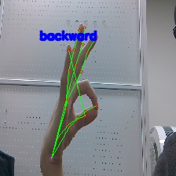

# 한밭대학교 SW중심대학 산학연계프로젝트 - 지능형 IoT 기술 분석 및 소프트웨어 개발

## **팀 구성**
### 지도교수
 - 김은경 교수님

### 기업체 
 - 로보볼트, 정의림 대표

### 참여학생
 - 20161616 연제원
 - 20197132 주준하
 - 20181796 김민준
 - 20181602 최창수

## Project Background
- ### 필요성
  - 기존의 건설기계 장비로는 산업재해로 인한 사망자가 많음   
  - 내부 근로자의 시야가 확보되지 않고 주변을 살피지 못해 발생함.   
- ### 기존 해결책의 문제점
  - 건설장비에서 외부를 감지하는 IoT 기술만을 활용하여 안전 문제를 해결해왔음.
  - IoT장비로는 탐지할수 없는 anomaly한 상황에 취약점이 드러남.

## System Design
  - ### System Requirements
This project aims to control excavation equipment and forklifts through hand gestures. The project adapt modern deep learning using hand gesture recognition and implemented tilt pose.
This project has tested on Jetsno NANO with the following environments:
   - python 3.6.9
   - trt_pose 0.0.1
   - Pytorch 1.0.0a0
   - sklearn 0.24.2
   - Jetson Nano Robot library.

    
## Case Study
- There are many deaths caused by industrial accidents in construction machinery.   
- It is caused by the lack of visibility of internal workers and the inability to look around.   
- It can be safely operated by checking the field of view through the hand motion detection robot control system from the outside and operating heavy equipment.

### Application of ideas
- a forklift truck
 - Basic behavior of forklifts

  

  
Movement

  

    1. Forward – Backward 
    2. Up – Down 
    3. In front of tilt – back 
  

  

		After matching the basic movements of the forklift with the hand movements, the forklift is controlled with the hand movements

- an excavator
 - How the Excavator Works

  

  
Movement

  

   1. Boom Cylinder (Up – Down) 
		 2. Handle cylinder (upper – lower) 
		 3. Bucket cylinder (upper – lower) 
  

  

		The excavator operates each cylinder. It is complicated to control this with hand gestures. You have to come up with an idea to pump it automatically.

- a companion robot
 - High-five, stop, and take pictures. You can express various directions

 
#### In addition to heavy equipment, I think it can be applied in various ways.  

### Related technology
- "Samsung Electronics' All-in-One PC" that recognizes hand movements and works

- Amazon AI Secretary Recognizing Sign Language "Alexa"

### Introduction to ideas
- Recognizing a person's hand movements through a camera
- Robot control for each movement, and various movements can be customized.

  
## Conclusion
It can be safely operated by checking the field of view through the hand motion detection robot control system from the outside and operating heavy equipment.
The machine recognizes the following hand movements and performs the following functions.  

 
Movement

 

  1. Fist = Stop 
  2. One finger (finger) = left 
  3. Palm = Go straight 
  4. Two Fingers (V) = Right 
  5. Okay = Back up 
 

 
  
 

## Project Outcome
- ### JETSON AI SPECIALIST CERTIFICATION